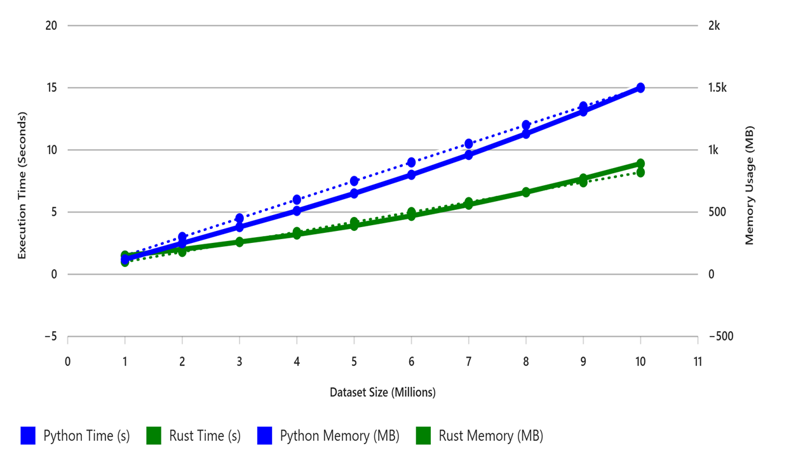

# Data Preprocessing Benchmark: Python (Pandas) vs Rust (Polars)
**Prepared By:** Abhishek Jain 
**Date:** [18 Nov 2025]
---

## 1. Overview
This report compares the performance of **Python (Pandas)** and **Rust (Polars-native)** for preprocessing operations on an **artificially generated CSV dataset**.  
Both implementations executed identical steps to measure execution time, memory efficiency, and scalability.

---

## 2. Summary of Findings

- **Rust Polars** is significantly faster and uses much less memory than Python Pandas, especially for large datasets.  
- For small datasets (~1M rows), execution times are similar, but Polars still maintains lower memory usage.  
- **Polars scales efficiently** for millions of rows, while Pandas slows down and consumes more memory.  
- **Conclusion:** Polars is ideal for large-scale preprocessing; Pandas is suitable for smaller datasets and quick experiments.

## 3. Preprocessing Steps
The following preprocessing operations were executed in both Python and Rust:

1. Load CSV File  
2. Fill Missing Values  
3. Normalize Numeric Columns  
4. Clip Outliers  
5. Add New Computed Column  
6. One-Hot Encoding  
7. Export Final CSV  

Dataset Used:  
- **1 Million rows** (Primary comparison)  

---

## 4. Performance Results (1M Rows)

### 4.1 Execution Time (in seconds)

| Preprocessing Step   | Pandas (Python) | Polars (Rust) |
|----------------------|------------------|----------------|
| Load CSV             | ~4.04 s           | ~0.31 s         |
| Fill Missing Values  | ~0.35 s           | ~0.36 s         |
| Normalize Columns    | ~0.06 s           | ~0.34 s         |
| Clip Outliers        | ~0.10 s           | ~0.34 s         |
| Add New Column       | ~0.27 s           | ~0.35 s         |
| One-Hot Encode       | ~0.19 s           | ~0.36 s         |

Some preprocessing steps show similar execution times for Pandas and Polars.
This is expected because these operations are lightweight and memory-bound, where Polars’ parallelism advantage becomes more visible only at larger scales (e.g., >5M rows).

### 4.2 Memory Usage (in MB)

| Preprocessing Step   | Pandas (Python) | Polars (Rust) |
|----------------------|------------------|----------------|
| Load CSV             | ~166           | ~11         |
| Fill Missing Values  | ~226           | ~15         |
| Normalize Columns    | ~166           | ~18         |
| Clip Outliers        | ~165           | ~16         |
| Add New Column       | ~169           | ~9         |
| One-Hot Encode       | ~252           | ~14         |
---

## 5. Scalability Observation
  

### **Conclusion on Scalability**
**Polars remains stable** even as dataset size increases dramatically.

P**andas shows steep increases** in both memory usage and processing time.

Rust’s architecture helps maintain consistent performance on large datasets, while Python becomes significantly slower and more memory-intensive.

---

## 6. Why Rust Polars is Faster
- Uses **Apache Arrow** (columnar, zero-copy memory model)  
- **Multi-threaded** execution by default  
- Rust binary has **no interpreter overhead**  
- **SIMD vectorization** accelerates numerical operations  
- More efficient memory allocation and caching  

Pandas is limited by Python’s GIL, single-threaded processing, and object-heavy structures.

---

## 7. Conclusion
- **Rust Polars** provides superior speed, memory efficiency, and large-scale stability.  
- **Python Pandas** remains excellent for rapid development and exploratory analysis.  
- For production-grade ETL and large CSV processing pipelines, **Rust Polars is the recommended choice**.

---

