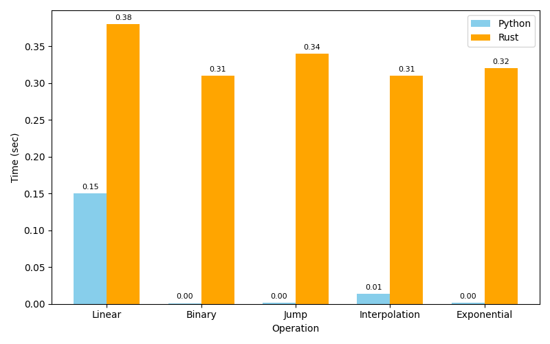

# Search Algorithm Benchmarking: Python vs Rust
**Prepared By:** Abhishek Jain
**Date:** [18 Nov 2025]

---

## 1. Overview
This report compares two implementations of search algorithms:

- **Python**
- **Rust**

The benchmark evaluates five search algorithms:

- **Linear**
- **Binary**
- **Jump**
- **Interpolation**
- **Exponential**

Benchmarks include:

- Execution time  
- Memory usage  
- Dataset sizes: **1M**, **10M**, and **100M integers**

---

## 2. Summary of Findings

### ✅ Rust demonstrates consistent performance and lower memory usage  
### ✅ Rust uses significantly less memory for large datasets  
### ❗ Python is faster for small datasets due to optimized libraries  
### ⚡ Rust scales better for large datasets  
### 🧑‍💻 Python is easier to implement, Rust is better for production-grade systems  

---

## 3. Execution Time Analysis — 1M Dataset

| Algorithm      | Rust (sec) | Python (sec) |
|---------------|----------|-----------|
| **Linear**        | 0.38     | 0.15      |
| **Binary**        | 0.31     | 0.0011    |
| **Jump**          | 0.34     | 0.0012    |
| **Interpolation** | 0.31     | 0.0134    |
| **Exponential**   | 0.32     | 0.0014    |

---

## 4. Execution Time Analysis — 10M Dataset

| Algorithm      | Rust (sec) | Python (sec) |
|---------------|----------|-----------|
| **Linear**        | 0.29     | 0.1750    |
| **Binary**        | 0.2896   | 0.0001    |
| **Jump**          | 0.2845   | 0.0016    |
| **Interpolation** | 0.2743   | 0.0002    |
| **Exponential**   | 0.2432   | 0.0001    |

---

## 5. Execution Time Analysis — 100M Dataset

| Algorithm      | Rust (sec) | Python (sec) |
|---------------|----------|-----------|
| **Linear**        | 0.29     | 2.7852    |
| **Binary**        | 0.2896   | 0.0001    |
| **Jump**          | 0.2845   | 0.0016    |
| **Interpolation** | 0.2743   | 0.0002    |
| **Exponential**   | 0.2432   | 0.0001    |

Rust remains stable across dataset sizes, while Python slows significantly for large datasets.

---

## 6. Memory Usage Comparison

### **1M Dataset**
| Algorithm      | Rust (MB) | Python (MB) |
|---------------|-----------|------------|
| **Linear**        | 6         | 530        |
| **Binary**        | 11        | 532        |
| **Jump**          | 11        | 531        |
| **Interpolation** | 6         | 529        |
| **Exponential**   | 4         | 525        |

### **10M Dataset**
| Algorithm      | Rust (MB) | Python (MB) |
|---------------|-----------|------------|
| **Linear**        | 6         | 540        |
| **Binary**        | 11        | 531        |
| **Jump**          | 11        | 532        |
| **Interpolation** | 6         | 532        |
| **Exponential**   | 4         | 534        |

### **100M Dataset**
| Algorithm      | Rust (MB) | Python (MB) |
|---------------|-----------|------------|
| **Linear**        | 6         | 4662       |
| **Binary**        | 11        | 4662       |
| **Jump**          | 11        | 4854       |
| **Interpolation** | 6         | 4649       |
| **Exponential**   | 4         | 4188       |

Rust uses **~4–13 MB**, Python uses **~5000 MB** for 100M dataset.

---

## 7. Graphs (Placeholders)

### 📊 Execution Time Comparison  

### 📊 Memory Usage Comparison  

## 8. Conclusion

### ⭐ Rust clearly outperforms Python in:
- Memory efficiency  
- Consistent performance for large datasets  
- Scalability  

### ⭐ Python strengths:
- Faster for small datasets  
- Easier to implement  
- Rich ecosystem  

### ⭐ For large-scale, high-performance systems,  
**Rust is the recommended choice**.

---
