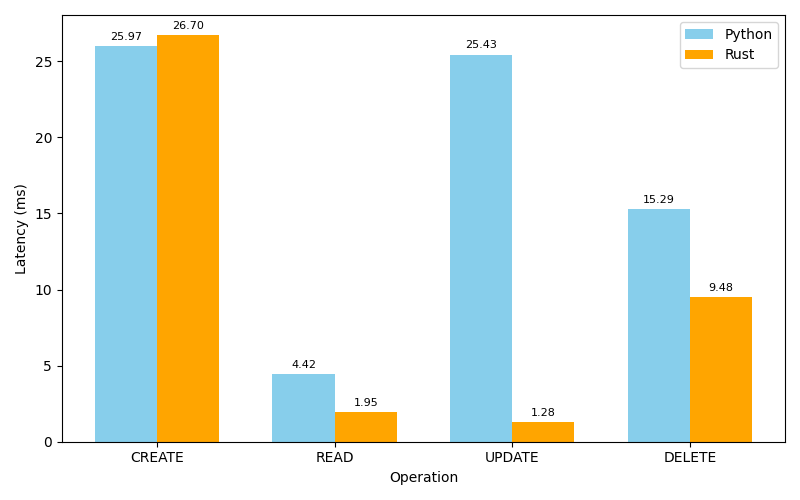

# Web Framework Performace: Python vs Rust  
**Prepared By:** Abhishek Jain 
**Date:** [18 Nov 2025]

---

## 1. Overview
This report compares two backend implementations:

- **Python (Flask)**
- **Rust (Actix)**

It also analyzes performance differences between:

- **Python ORM (SQLAlchemy)**
- **Python Raw SQL**

Benchmarks include:

- CRUD operations  
- Bulk operations  
- Latency  
- Memory usage  

---

## 2. Summary of Findings

### ✅ Rust is consistently faster (5×–20×)  
### ✅ Rust uses significantly less memory  
### ❗ Python ORM is the slowest and uses the most memory  
### ⚡ Raw SQL in Python is ~2× faster than ORM  
### 🧑‍💻 Python is easier to build, Rust scales better for production  

---

## 3. Latency(Time) Comparison — 
### Single CRUD Operations

| Operation | Python (Raw SQL) | Rust |
|----------|-------------------|------|
| **Create** | ~25 ms | ~23 ms |
| **Read** | ~4.6 ms | ~1.9 ms |
| **Update** | ~25 ms | ~2.2 ms |
| **Delete** | ~13 ms | ~9 ms |

Rust is **3×–10× faster** depending on the operation.

---

### Bulk Operations (100 Tasks)

| Bulk Operation | Python (Raw SQL) | Rust |
|----------------|------------------|------|
| **Bulk Create** | ~1785 ms | ~452 ms |
| **Bulk Read** | ~8 ms | ~5 ms |
| **Bulk Update** | ~2101 ms | ~330 ms |
| **Bulk Delete** | ~2338 ms | ~460 ms |

Rust scales significantly better under heavy load.

---

## 4. Memory Comparison

### Framework Memory Usage

| Framework | Memory Usage |
|----------|--------------|
| **Python (Flask – Raw SQL)** | ~44 MB |
| **Python (Flask – ORM)** | ~72 MB |
| **Rust (Actix)** | ~32 MB |

Rust uses **40–60% less memory**.

ORM consumes **~28 MB more** than Raw SQL due to:

- Model hydration  
- ORM session & metadata  
- Object mapping overhead  

---

## 5. ORM vs Raw SQL (Python Only)

### Single CRUD Comparison

| Operation | ORM (SQLAlchemy) | Raw SQL |
|----------|-------------------|---------|
| **Create** | ~27 ms | ~25 ms |
| **Read** | ~9.4 ms | ~4.6 ms |
| **Update** | ~40 ms | ~15 ms |
| **Delete** | ~35 ms | ~13 ms |

Raw SQL is **~2× faster** than ORM.

---

### Bulk (100 Tasks)

| Operation | ORM (ms) | Raw SQL (ms) |
|----------|----------|---------------|
| **Bulk Create** | ~4253 ms | ~1785 ms |
| **Bulk Update** | ~3988 ms | ~2101 ms |
| **Bulk Delete** | ~4433 ms | ~2338 ms |

ORM is **2× slower** because it performs extra work:

- Object creation  
- Session state management  
- Metadata checks  
- Validation layers  

---

## 6. Graphs (Placeholders)

### 📊 Single CRUD Comparison  

### 📊 Bulk Operations Comparison  (Bulk 100)

### 📊 ORM vs Raw SQL Comparison  (Single CRUD )

### 📊 Memory Usage Comparison  (Bulk 100)

---

## 7. Conclusion

### ⭐ Rust clearly outperforms Python in:
- Speed  
- Memory efficiency  
- Bulk throughput  
- High concurrency scenarios  

### ⭐ Python strengths:
- Faster development  
- Easier to write and maintain  
- Larger ecosystem  

### ⭐ Raw SQL improves Python performance,  
but **Rust still leads** for production-grade, high-load systems.

---

